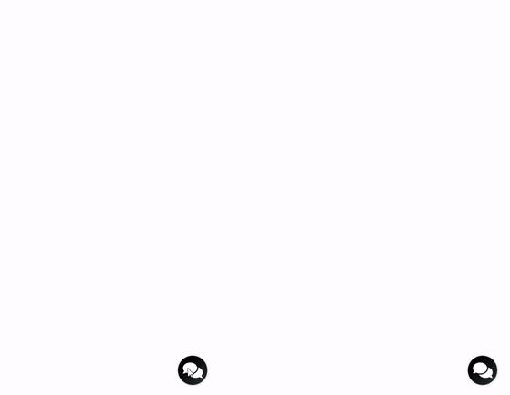

# ReactBot

## Features at a glance

- Responsive, user friendly chat interface
- Totally customizable
- Supports [multiple bot instances](#multiple-bots) on a single page (v2 and above)
- Extremely low learning curve
- Lightweight

## Demonstration


[Fork our repository](https://github.com/cozimacode/react-bot "Fork our repository") if you'd like to play with the demo.

## Installation

#### npm

```bash
npm install @cozimacode/react-bot
```

#### yarn

```bash
yarn add @cozimacode/react-bot
```

#### UNPKG

```html
<script src="https://unpkg.com/@cozimacode/react-bot"></script>
```

You can access it via window.ReactBot

## Usage

1- Import the ReactBot component and the stylesheet in your app and pass the mandatory `handleUserInput` prop that accepts a function to process the user input.

```js
import React from "react";
import { ReactBot } from "@cozimacode/react-bot";
import "@cozimacode/react-bot/dist/styles.css";

function Demo() {
  const handleUserInput = (input) => {
    //You can send this message to the backend or mock a response
  };

  return <ReactBot handleUserInput={handleUserInput} />;
}

export default Demo;
```

2- Import the `addBotMessage` method to add a plain text bot response.

```js
import React from "react";
import { ReactBot, addBotMessage } from "@cozimacode/react-bot";
import "@cozimacode/react-bot/dist/styles.css";

function Demo() {
  const handleUserInput = (input) => {
    if (input.indexOf("Hi") > -1) {
      addBotMessage("Hi there!");
    }
  };

  return <ReactBot handleUserInput={handleUserInput} />;
}

export default Demo;
```

3- You are in the driver's seat when it comes to customization. You can set an initial response, change the title, the launch icon, the avatar etc. See [Props](#props "Props") below for all available customizations.

```js
import React from 'react';
import { ReactBot } from '@cozimacode/react-bot';
import launcherIcon from './launcherIcon.png';
import "@cozimacode/react-bot/dist/styles.css";

function Demo() {
    const handleUserInput = (input) => {
    ...
  };

    return (
      <ReactBot
        handleUserInput={handleUserInput}
        customLauncherIcon={launcherIcon}
        title="ReactBot"
        messagePlaceHolder="Type something here..."
      />
    );
}

export default Demo;

```

## Props <a name="props"></a>

| prop                   | type                                                                    | required                                               | default value     | description                                                                                                                                                                                           |
| ---------------------- | ----------------------------------------------------------------------- | ------------------------------------------------------ | ----------------- | ----------------------------------------------------------------------------------------------------------------------------------------------------------------------------------------------------- |
| **autofocus**          | boolean                                                                 | NO                                                     | true              | Focuses on the input field on launch.                                                                                                                                                                 |
| **botId**              | string                                                                  | YES (if using [multiple bots feature](#multiple-bots)) | default           | Passing a unique ID to this prop is mandatory only if you require multiple bots on the same page.                                                                                                     |
| **chatAvatar**         | string                                                                  | NO                                                     |                   | The chat avatar for the bot response.                                                                                                                                                                 |
| **className**          | string                                                                  | NO                                                     |                   | Useful for custom styling and overwriting default styles.                                                                                                                                             |
| **customLauncherIcon** | string                                                                  | NO                                                     |                   | Change the default launcher icon/image.                                                                                                                                                               |
| **handleUserInput**    | (input: string, showTyping: () => void, hideTyping: () => void) => void | YES                                                    |                   | Accepts a function that processes the user input. The first argument depicts the user input as a string. The second and third arguments are functions to show and hide typing indicator respectively. |
| **initialResponse**    | object                                                                  | NO                                                     |                   | Accepts an object with keys Component, props and avatar, just like `addCustomResponse` method. Use it to show a default response.                                                                     |
| **messagePlaceHolder** | string                                                                  | NO                                                     | Type a message... | Placeholder for input.                                                                                                                                                                                |
| **title**              | string                                                                  | NO                                                     | Hi, there!        | Title for the chat widget.                                                                                                                                                                            |
| **titleAvatar**        | string                                                                  | NO                                                     |                   | The picture that will be shown before the title in header.                                                                                                                                            |
| **typingGif**          | string                                                                  | NO                                                     |                   | Show a different gif/png for typing indicator.                                                                                                                                                        |

## Overriding Styles

Feel free to create a custom CSS stylesheet and override the default CSS classes to match your overall app design. All styles are prefixed with `rcb-` to avoid any conflicts.

```css
.rcb-bot-message {
  background-color: #afd2ff;
}

.rcb-user-message {
  background-color: #c53658;
}
```

## Methods <a name="methods"></a>

- **addBotMessage**
  You can use this method to simulate a response from the bot after processing the user input through the backend. The first argument accepts a plain text value. The second argument takes the **botId** which only needs to be passed if using the multiple bots feature and needs to match the ID you pass to `ReactBot`.

- **addUserMessage**
  This method can be used to add a message as a user without invoking the `handleUserInput` function. First argument accepts a plain text value. For the second argument, it is same scenario as mentioned above for `addBotMessage`.

- **addCustomComponent**
  This is used to add any custom React component. The first argument accepts an object with the component class, props for it (if any) and an optional boolean to show/hide the chat avatar. For the second argument, it is same scenario as mentioned above for `addBotMessage`.

  ```js
  addCustomComponent({
    Component: CustomReactComponent,
    props: { propOne: value, propTwo: value },
    avatar: true,
  });
  ```

## Multiple Bots <a name="multiple-bots"></a>



v2 and above supports multiple bot instances on the same page. Passing the `botId` prop with a unique identification key is mandatory when using this feature.

Also, the [methods above](#methods) need the **same ID** passed to them as the second argument. Check the [demo project](https://github.com/cozimacode/react-bot/tree/master/demo) for a sample of multiple bots.

## Need further customization?

You are more than welcome to [fork our code repository](https://github.com/cozimacode/react-bot "fork our code repository") and make any changes or add any custom features as you please. If you feel like sharing your work with the community, then we'd love for you to [contribute to this project](https://github.com/cozimacode/react-bot/blob/master/CONTRIBUTING.md "contribute to this project").

## About

This project is written and maintained by [Naser Baig](https://github.com/cozimacode).

I am always looking for exciting projects to work on. If you happen to be working on one of them and need a frontend engineer, then [let's connect](https://www.linkedin.com/in/nasermohdbaig/ "let's connect").
